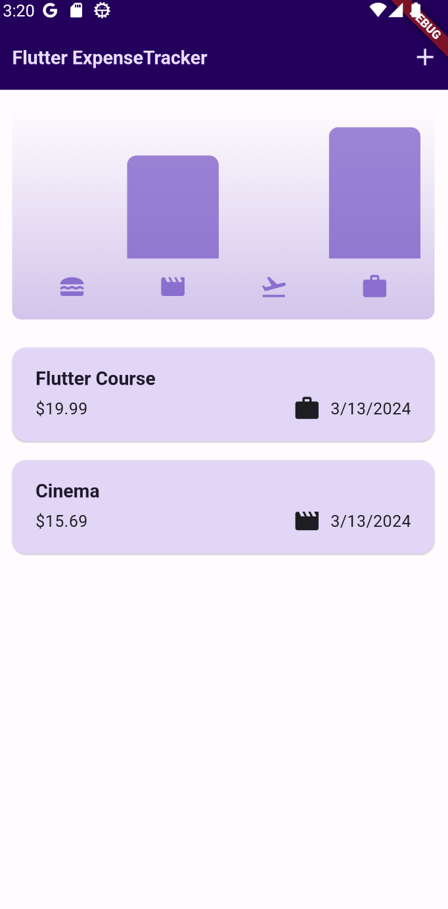
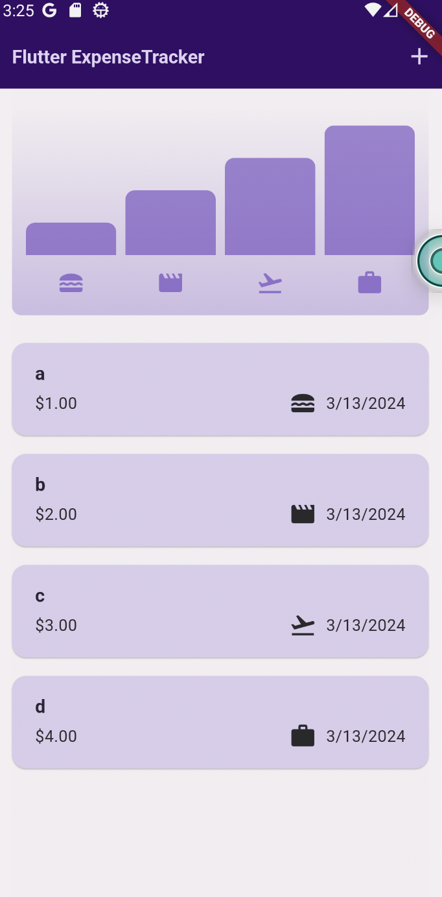
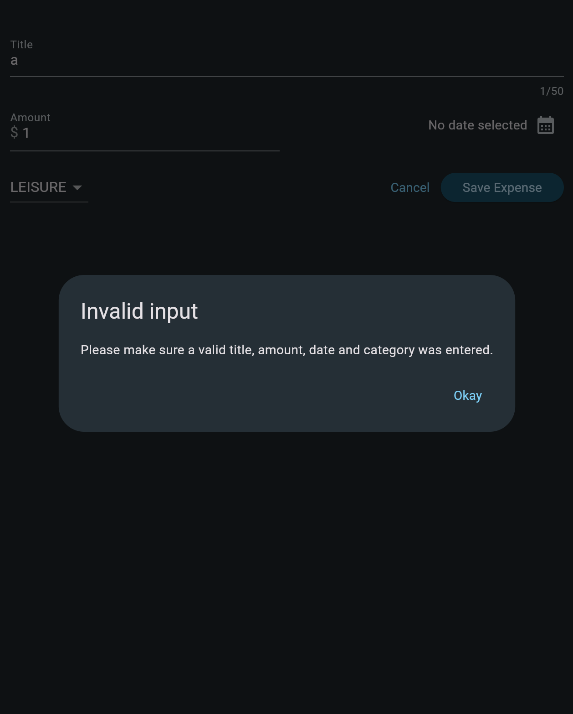
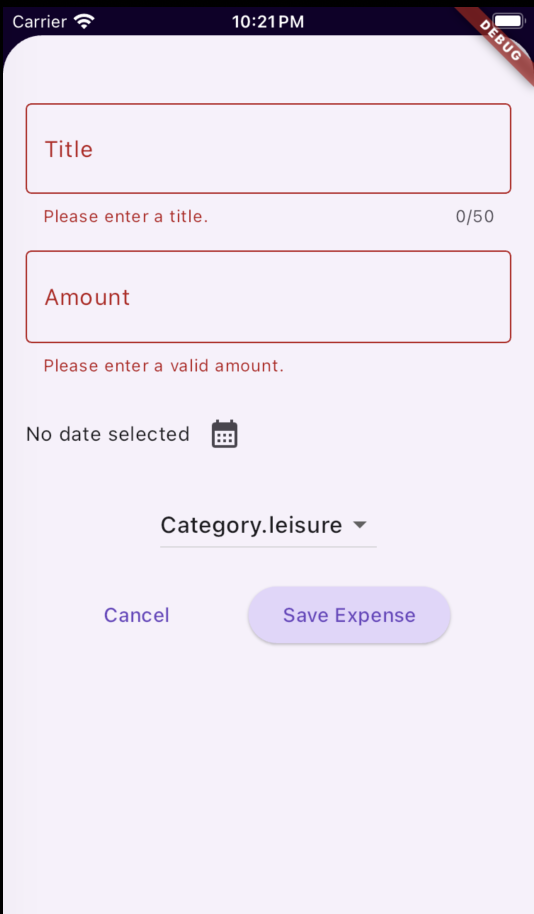
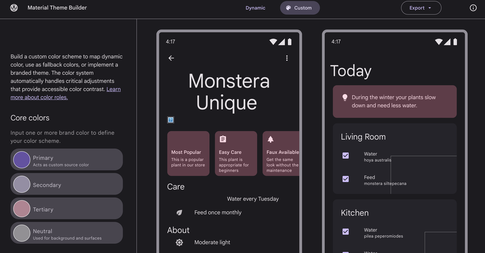
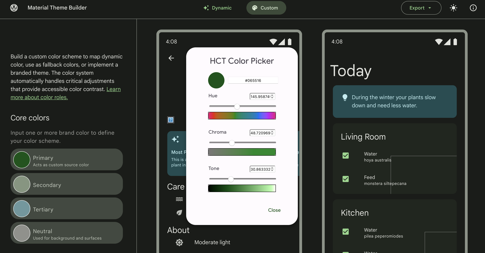

# Lab 03 Expense Tracker app - lab

## WARNING

請不要再度**交錯lab code到master branch**，繳交後請自行到課程公開檔案夾（courses > software-studio > 2024-spring >lab-flutter-basics-dart-expense-tracker-app)，左側點擊Merge requests，查詢自己的學號後點擊Request to merge (你的學號 ： 你的分支 ）的 **你的分支**（通常會是master），確認顯示的是你繳交的最新版本的code。以及確認Request to merge (你的學號 ： 你的分支 ）into (你的學號)，「into (**你的學號**)」要是**自己的學號**。

若發生上述情況會導致**扣分或評為0分**。請特別注意。

若有發現錯誤最保險的方式就是點擊下方的Close merge request後，重新發送一個merge request。

Please **do not** merging the **lab code to the master branch** again. After submitting, please navigate to the course public folder (courses > software-studio > 2024-spring > lab-flutter-basics-dart-expense-tracker-app) and click "Merge requests" on the left. Searching your student ID and click "Request to merge (your student ID: your branch)" for **your branch** (usually master), ensuring that the latest version of the code you submitted is displayed. Confirm "Request to merge (your student ID: your branch) into (your student ID)", where "into (**your student ID**)" should be displayed **your own student ID**.

If the above situation occurs, points will **be deducted or rated as 0 points**. Please pay special attention.

If an error is found, the safest way to proceed is to click "Close merge request" below and resend a merge request.

## Lab Description
In this lab course, you will be tasked with implementing **three functions** that were discussed in class.

The first part is to implement the **chart**, described as follows:

 ( 40% )  
   

After entering values from the form, the chart will display the difference in bar heights between each category, reflecting the proportion of each item's total amount.

    

The second part is to implement the **form**, described as follows:

The Invalid Input warning displayed in the sample program is as follows. 
   

 ( 30% )  
Now, you need to modify it to utilize a Form to implement this area and display the warning below each text field as shown below.
   

The third part is to implement the **Customized Theme**, described as follows:

   

 ( 30% )  
Utilize the Material Theme Builder (select "Customize" in the theme design tool mentioned in the course) to configure the theme and dark theme (with a free choice of colors) for your application theme.

   

## Deadline
Submit your work before 2024/03/14 (Thur.) 17:20:00.

The score you have done will be 100%.

Submit your work before 2024/03/14 (Thur.) 23:59:59.

The score of other part you have done after 17:20:00 will be 60%.

# Resources

A few introductory tutorials crafted to assist you in completing today's lab.

- [Chart bar implementation](https://api.flutter.dev/flutter/widgets/FractionallySizedBox-class.html)
    * Pay particular attention to the heightFactor or widthFactor of the FractionallySizedBox.
- [Form](https://dev.to/aspiiire/easy-way-to-write-forms-in-flutter-37ni)
- [Material Theme Builder](https://m3.material.io/theme-builder#/custom)